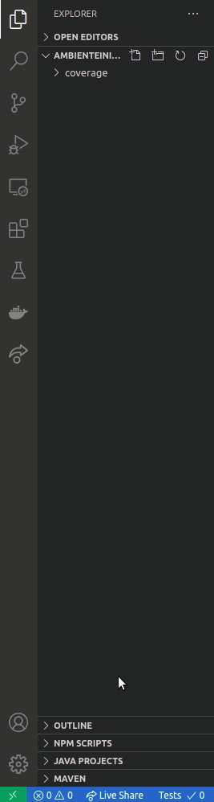

# Ambiente Inicial de desarrollo con devcontainer

Este proyecto hace uso de Docker, NodeJS y Visual Studio Code para facilitar el aprendizaje.

## Prerequisitos

1. Tener instalado **Docker**
1. Tener instalado **Visual Studio Code**

## Crear el ambiente de desarrollo con devcontainer

Haga clic en el ícono de ventana remota ubicado en la parte inferior izquierda de Visual Studio Code.

Luego en el la consolo de Visual Stutio Code Seleccione adicionar proyecto de contenedor remoto y busque la configuración para **NodeJS**

## Un Hola Mundo con Google

Para ello vamos a usar el API de Google Spreadsheets para leer este mensaje desde una hoja de cálculo.

### Habilitar el API

Se puede ir a la documentación del API en la guía de inicio rápido [Aguí](https://developers.google.com/sheets/api/quickstart/nodejs)

### Liberíaas a usar

Para comunicarnos con la hoja de cálculo vamos a instalar esta libería en el proyecto:

npm install googleapis@39 --save

**Nota:** Este proyecto ya la tiene instalada

